# parkify-iOS

a social meet-up app with live chat feature

- The app was originally one of my group project (that app called frosty) while I was doing my nothcoders bootcamp, which built by team of 4, in which we have been pair programming throughout and I was involved in every aspect of frontend build, as well as building both the frontend and backend of the live chat component with socketIO.

- The group project was a web only app, so I started this project to port it into an mobile app which will run on both iOS and android, as well as any web browsers. I am also planning to built a serverless backend to replace the original backend, and also expand to some extra features.

## App versions

- The app is mostly done but it is **still in progress**, there is a web version which is hosted at:

- The web version has only been tested when running in iphone X mode. (**you have to refresh after you have choosing iphone X in developer mode, in your browser**)

- The app is not been tested in Android yet, in iOS, I have tested in running in iphone 8 Plus, iphone X and iphone 13. Although the iphone version is still in progress but good enough to show a demo.

- **the main stack used is React Native with expo, mongoDB and socketIO**.

- the Chat component is built from scratch with websocket library socketIO and used mongoDB's cloud based backend.

- the Chat component has its own backend which is separate from the main backend. It resides in server folder in the frontend repo here.

---

## How to use

- To see a hosted version on web, visit: (**you have to refresh after you have choosing iphone X in developer mode, in your browser**)
  for best experience, follow steps below to run natively on your phone or ios simulator.

- the app is built using node version v16.3, it will work on any v16 based node versions, might not work on v17.

- Clone the entire repo into a local folder, type 'npm install' in terminal to install all dependencies before running the app.

```
$ git clone https://github.com/cynthiaswill/parkify-iOS.git
$ cd parkify-iOS
$ npm install
```

- Type 'npm start' in terminal to start the app in browser. This will concurrently start both the server and the client (please check json script)

- Alternatively you can use 'npm run server' to start chat server, then use 'expo start' to run the app, once expo started you can type 'i' for ios, 'w' for running in web browser, or 'a' to run as android.

---

## screenshots

- on iOS iphone 13
<div align="center">
  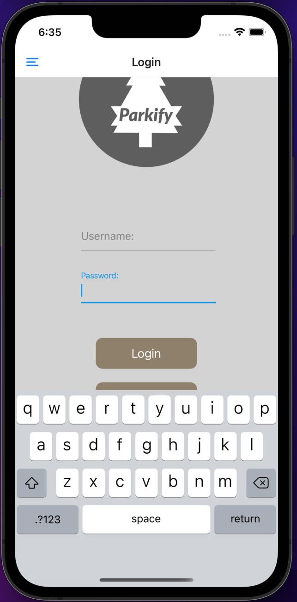
  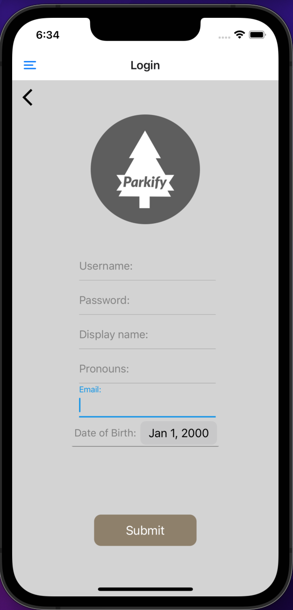
  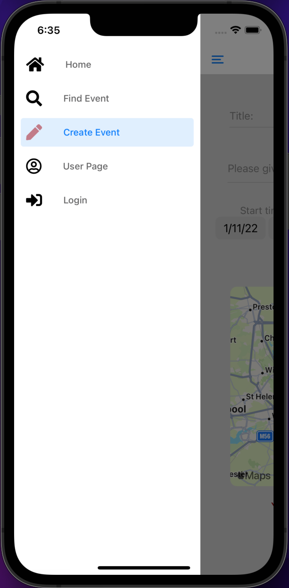
  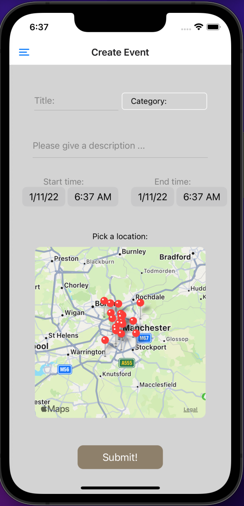
  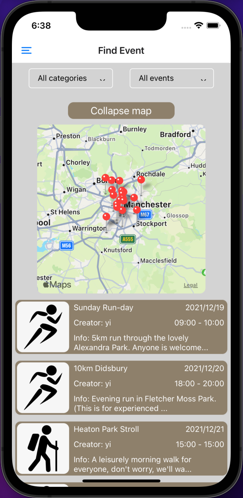
  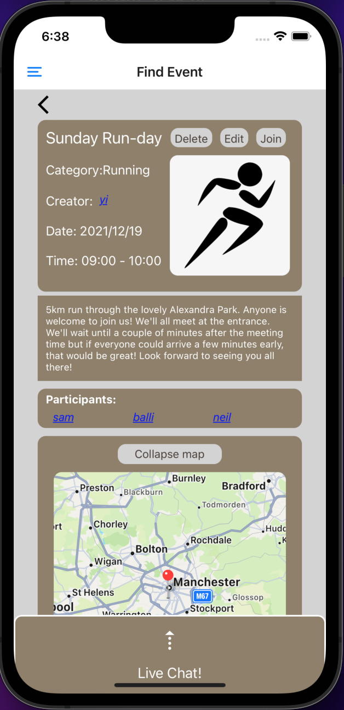
  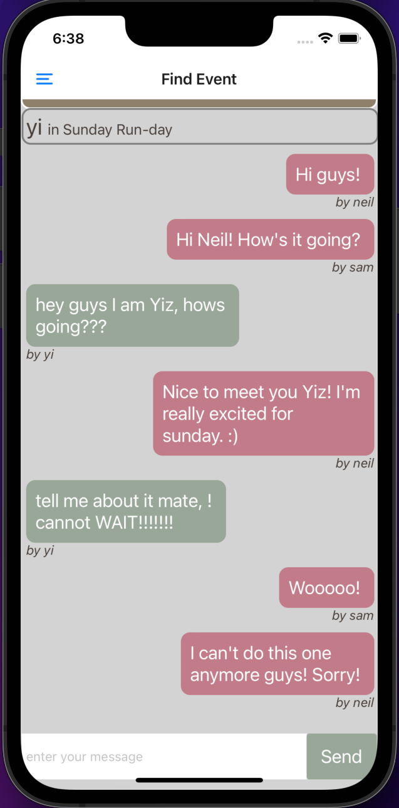
</div>
- on web browser
<div align="center">
  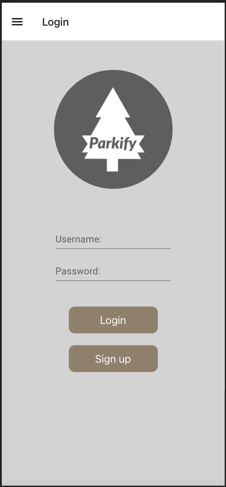
  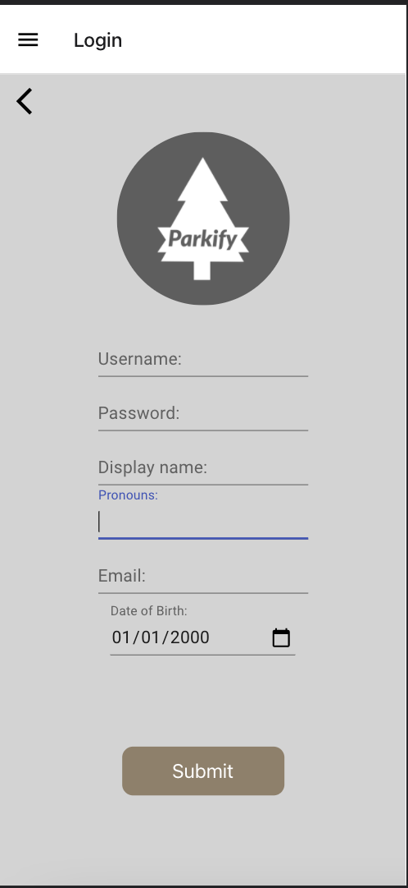
  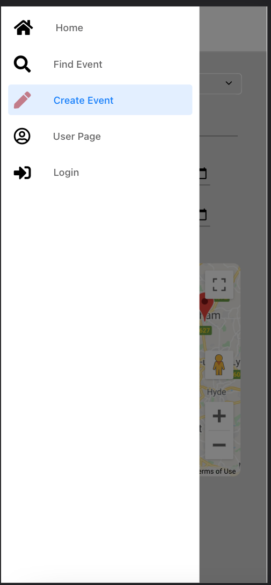
  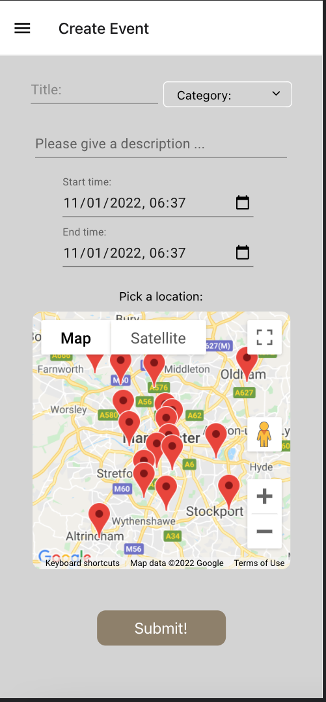
  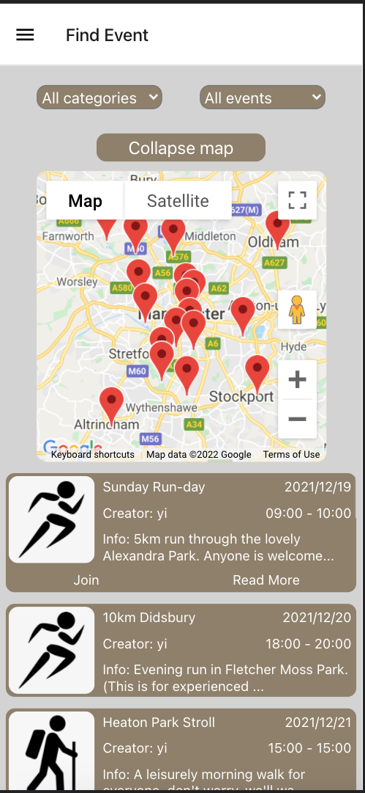
  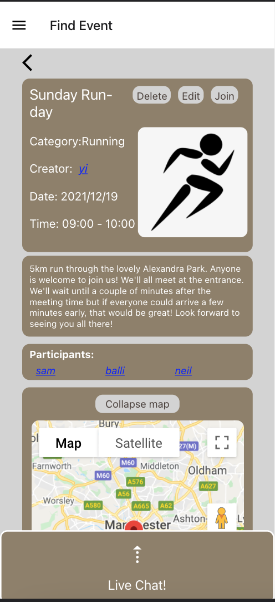
  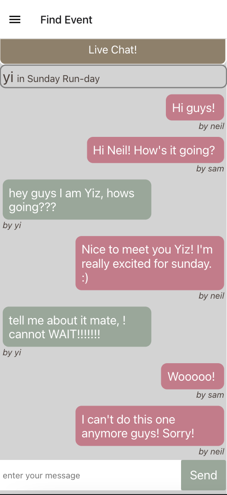
</div>

#

## User Stories

- As a user I Would to be able to create an event
- As a user I would like to view events on a map
- As a user I would like to filter events by different characteristics/categories
- As a user I would register an account
- As a user I can live chat with other people on the event page
- As a user I can see previous events I have attended
- As a user I can view another user's page and see previous events they have organised
- As a user I can mark myself as participating in an event
- As a user I can remove myself from an event
- As a user I can edit my profile
